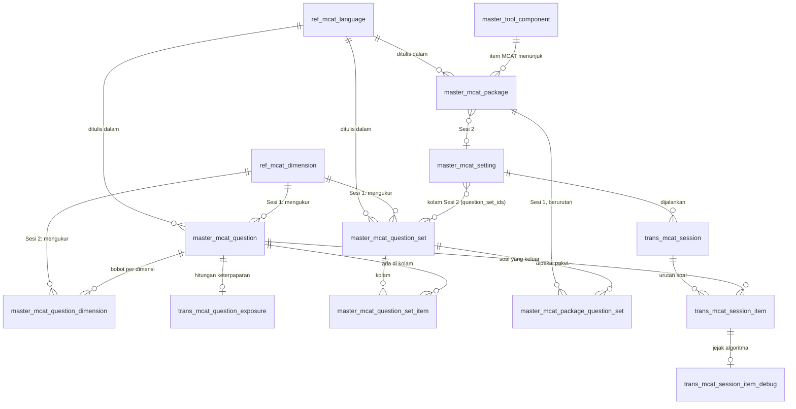

# MCAT — model data

Semua tabel MCAT dan hubungannya. Penamaannya mengikuti konvensi lama: `ref_` untuk daftar acuan, `master_`
untuk konten yang disusun admin, `trans_` untuk jejak pengerjaan peserta.

Skemanya ada di `apps/api/src/db/local/schema.ts`. Tiap layar menyebut tabel yang disentuhnya di `backend.md`-nya
masing-masing; dokumen ini yang menyatukan gambarannya.

## 1. Diagram



## 2. Tabel acuan

| Tabel | Kolom penting | Catatan |
| --- | --- | --- |
| `ref_mcat_language` | `id`, `name`, `sort_order`, `is_active` | Ruang lingkup tiap layar MCAT. `id` pendek dan huruf besar: `EN`, `ID`. Aturannya di [README area §4.1](README.md#41-bahasa-konten) |
| `ref_mcat_dimension` | `id`, `code` unik, `name`, `description`, `is_active` | `code` huruf kecil dan **tetap**: dipakai sebagai nama kolom template CSV, prefiks kode soal, kunci `a_params`, dan isi `tested_dimensions`. `is_active = 0` berarti tidak ditawarkan lagi, bukan terhapus — lihat [Dimensions](dimensions/README.md) |

## 3. Konten

### 3.1 `master_mcat_question` — soal

| Kolom | Isinya |
| --- | --- |
| `id` | Kunci sebenarnya. Ini yang disimpan jejak pengerjaan |
| `code` | **Unik**. Label yang dipakai admin: dicari, dan jadi kunci pencocokan impor. Boleh diganti kapan saja |
| `session` | 1 atau 2. Menentukan field mana yang diminta form dan Question Set mana yang boleh memuatnya |
| `language_id` | Bahasa soal |
| `dimension_id` | **Sesi 1 saja.** Atribut katalog: supaya soal bisa dicari. NULL untuk Sesi 2 |
| `content`, `choices`, `answer_key` | Soalnya sendiri. `choices` JSON `[{key, text, image}]` |
| `content_area` | Dimensi dominan, dipakai sebagai area pelaporan |
| `image_url`, `image_position`, `image_aspect_ratio`, `option_layout` | Tampilan soal ini — lihat [Item Bank frontend §1.2](item-bank/frontend.md) |
| `d_param`, `c_param`, `sh_r_param` | **Sesi 2 saja.** Kesulitan, tebakan, kontrol keterpaparan |
| `is_active` | Soal nonaktif tidak pernah dikeluarkan |

### 3.2 `master_mcat_question_dimension` — bobot per dimensi

`question_id` + `dimension_id` + `a`. PK komposit, jarang penuh: satu baris hanya untuk dimensi yang
benar-benar diukur soal itu.

Sesi 2 mengisi beberapa baris dengan bobot berbeda. Sesi 1 mengisi **satu** baris berbobot 1, diturunkan dari
`dimension_id` soal itu — supaya semua yang membacanya di hilir melihat satu bentuk yang sama.

### 3.3 `master_mcat_question_set` — kumpulan soal

| Kolom | Isinya |
| --- | --- |
| `dimension_id` | **Sesi 1: wajib.** Ini dimensi yang **dinilai**. NULL untuk Sesi 2 |
| `language_id`, `session` | Milik set itu sendiri; tidak ada wadah di atasnya yang menyimpannya |
| `duration_minutes` | Sesi 1: waktu untuk seluruh set, dalam menit, minimal 1 |
| `item_count` | NULL berarti seluruh kolam keluar sesuai urutan; N berarti N soal acak |

### 3.4 `master_mcat_question_set_item` — kolam

`question_set_id` + `question_id` + `sort_order`. PK komposit.

Tabel inilah yang membuat satu soal bisa dipakai beberapa set. `sort_order` hanya berarti kalau `item_count`
kosong — kalau N terisi, urutannya sudah acak.

### 3.5 `master_mcat_setting` — adaptive setup

`question_set_ids` (JSON, **tidak boleh kosong**) adalah kolam Sesi 2-nya. `tested_dimensions` berurutan, dan
posisinya dipakai `prior_mean`, `prior_cov_diag`, serta tiap vektor theta sesi yang dijalankannya. Sisanya
parameter algoritma — lihat [Adaptive Setups](adaptive-setups/README.md).

### 3.6 `master_mcat_package` dan `master_mcat_package_question_set`

Paket memegang `language_id` dan `session2_setting_id` (boleh NULL). Question Set Sesi 1-nya ada di tabel
jembatan, berurutan — urutan itu urutan peserta mengerjakannya.

## 4. Jejak pengerjaan

| Tabel | Isinya |
| --- | --- |
| `trans_mcat_question_exposure` | Berapa kali satu soal pernah keluar. Dipakai kontrol keterpaparan Sesi 2 |
| `trans_mcat_session` | Satu sesi peserta: status, `theta_hat`, `se_vector`, matriks informasi, alasan berhenti |
| `trans_mcat_session_item` | Satu baris per soal yang keluar: nomor urut, jawaban, theta sebelum dan sesudah |
| `trans_mcat_session_item_debug` | Kenapa soal itu yang dipilih. Diisi sesuai `debug_mode` setup |

Jejak menunjuk soal lewat `id`, bukan `code`. Karena itu kode soal boleh diganti tanpa merusak sesi lama.

## 5. Di luar tabel MCAT

Pemasangan MCAT ke sebuah tes **tidak** punya tabel sendiri. Ia hidup sebagai satu field di dalam item block
page milik Tool Component:

```
master_tool_component.structure  (JSON)
  └── blocks[].pages[].items[]
        └── item bertipe MCAT
              mcat: { packageId, session1Shuffle }
```

`session1Shuffle` sengaja tinggal di item, bukan di Package: dua tes boleh menjalankan paket yang sama dengan
urutan soal berbeda. Lihat [DEC-MCAT-05](decisions.md).

## 6. Aturan integritas

Yang dijaga di luar foreign key, karena tidak bisa dinyatakan sebagai constraint:

| Aturan | Di mana dijaga |
| --- | --- |
| Kode soal unik, huruf besar, pola `^[A-Z0-9][A-Z0-9-]{0,31}$` | Unique index + normalisasi saat tulis |
| Set hanya menerima soal yang sesi, bahasa, dan dimensinya cocok | Saat kolam ditulis |
| Dimensi set tidak berubah selama kolamnya berisi | Saat set disimpan |
| `item_count` ≤ isi kolam | Saat set disimpan, saat kolam ditulis, dan saat tes dimulai |
| Adaptive setup hanya menunjuk Question Set Sesi 2, minimal satu | Saat setup disimpan |
| Package: minimal satu sisi terisi, satu bahasa, tidak ada dimensi kembar | Saat paket disimpan |
| Soal tidak terhapus selama ada di kolam atau pernah dikerjakan | Saat soal dihapus |
| Question Set tidak terhapus selama ditunjuk Package atau setup | Saat set dihapus |
| Package tidak terhapus selama dipakai item MCAT | Saat paket dihapus |
