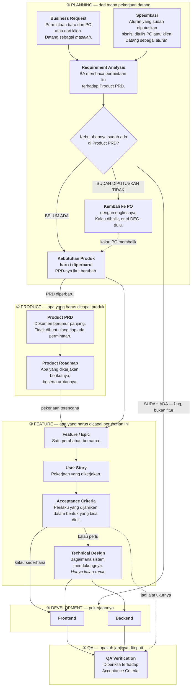
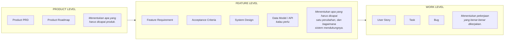
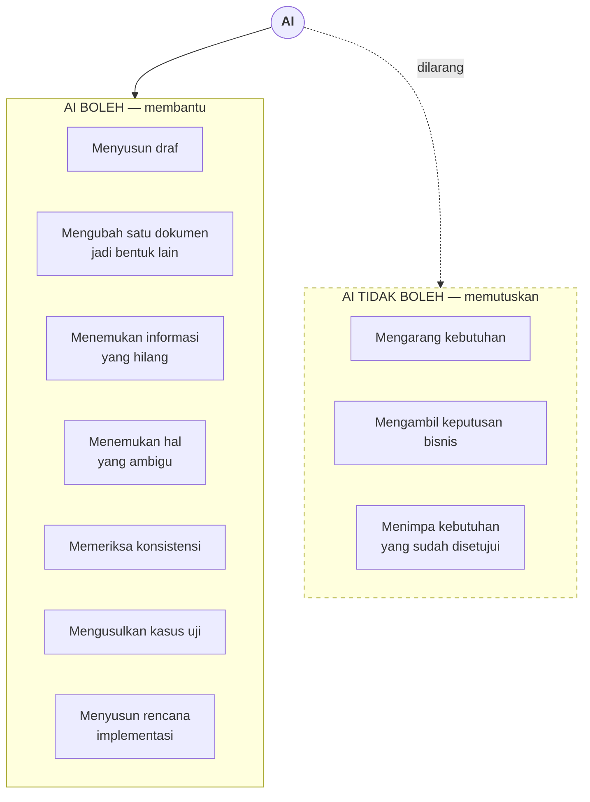

# Dari kebutuhan produk ke kode yang terverifikasi

Bagaimana sebuah permintaan berubah jadi pekerjaan, dan di mana AI ikut membantu.

> **AI membantu prosesnya. Manusia yang memiliki keputusannya.**

Satu permintaan nyata ditelusuri dari awal sampai selesai — beserta templat Business Request dan Requirement
Analysis yang bisa dipakai ulang — ada di **[workflow-example.md](workflow-example.md)**.

---

## 1. Alur utama



**Tiga pintu masuk, satu jalur keluar.** Pekerjaan terencana masuk lewat Roadmap. Permintaan baru masuk lewat
Business Request. Aturan yang sudah diputuskan bisnis masuk lewat Spesifikasi. Begitu kebutuhannya tercatat,
ketiganya bertemu di jalur yang sama.

**Business Request dan Spesifikasi berbeda di bentuk, bukan di tujuan.** Business Request menyerahkan sebuah
masalah dan membiarkan solusinya dianalisis. Spesifikasi menyerahkan aturannya langsung — bobot, ambang batas,
urutan tampilan — karena keputusannya memang bukan milik tim pengembang. Keduanya tetap lewat Requirement
Analysis yang sama.

Satu aturan yang membedakan penanganannya: **spesifikasi berwenang atas aturan bisnisnya, tidak berwenang atas
kelengkapannya.** Angka dan ambang batas di dalamnya diterima apa adanya. Input yang tidak disebut sumbernya
tetap jadi pertanyaan terbuka, tidak ditebak.

**Kotak keputusan itu punya tiga keluaran, bukan dua.** Kebutuhan yang **sudah ada** tidak melahirkan Feature /
Epic sama sekali — kalau sistem tidak berperilaku seperti yang tertulis, itu bug, dan `AC-` yang sudah ada jadi
alat ukurnya. Yang **belum ada** memperbarui PRD lebih dulu. Yang **sudah diputuskan tidak** kembali ke PO
beserta ongkosnya, karena yang berubah prioritas, bukan kemampuan teknis. Ketiganya diuraikan di
[workflow-example.md](workflow-example.md) §Tahap 3.

**PRD tidak dibuat ulang.** Kebutuhan baru menambah isinya — satu dokumen yang tumbuh, bukan tumpukan dokumen
sekali pakai.

---

## 2. Tiga tingkat dokumentasi



---

## 3. Di mana AI ikut



AI menyentuh **tiap tahap** di §1 — menyusun draf PRD, memecah Epic jadi Story, mengusulkan Acceptance
Criteria, menulis rencana implementasi, mengusulkan kasus uji QA. Yang tidak berubah di tahap mana pun:
persetujuan selalu tindakan manusia, dan informasi yang tidak ada ditandai `OPEN QUESTION:`, tidak ditebak.

---

## 4. Legenda

| Dokumen | Menjawab apa |
| --- | --- |
| **PRD** | Menentukan **produknya**. |
| **Feature** | Menentukan **perubahannya**. |
| **Story** | Menentukan **pekerjaannya**. |
| **Acceptance Criteria** | Menentukan **perilaku yang diharapkan**. |
| **Technical Design** | Menentukan **bagaimana sistem mendukungnya**. |
| **QA** | **Memverifikasi** perilakunya. |
| **Change Request** | Bukan dokumen. Business Request yang cabangnya **SUDAH ADA** atau **SUDAH DIPUTUSKAN TIDAK**. |

---

## 5. Bagaimana ini memetakan ke repo Engauge

Diagram di atas generik. Di repo ini, tiap kotak punya berkasnya sendiri:

| Kotak di diagram | Berkasnya di sini | Keadaan |
| --- | --- | --- |
| Product PRD | `docs/product/README.md` | **Belum ada** |
| Product Roadmap | `docs/product/ROADMAP.md` | **Belum ada** |
| Feature / Epic | `<layar>/README.md` §1–§3 — mis. [Dimensions](product/item-management/mcat/dimensions/README.md) | Ada |
| Acceptance Criteria | `<layar>/acceptance-criteria.md` | Ada, 304 ID |
| Technical Design | `<layar>/backend.md`, `<layar>/frontend.md`, dan `<area>/architecture.md` | Ada |
| Data Model | `<area>/data-model.md` | Ada |
| Keputusan + yang ditolak | `<area>/decisions.md` | Ada |
| Pertanyaan terbuka | `<layar>/README.md` §6, ber-ID `Q-` | Ada |
| QA Verification | Nama tes memuat ID AC-nya, diperiksa `bun scripts/docs-check.ts` | Ada, 56 AC terikat tes |
| Business Request / Spesifikasi | Issue tracker, berkas aslinya dilampirkan | Di luar repo |
| User Story / Task / Bug | Issue tracker | Di luar repo |

**Satu hal yang hilang, dan bukan kebetulan.** Struktur `docs/product/` mencerminkan sidebar CMS: ada di
`LOCAL_MENUS` berarti dapat folder. Aturan itu menjawab "dokumen layar ini taruh mana" tanpa perlu berpikir —
tapi **niat produk tidak punya entri menu**, jadi tidak ada tempat untuknya.

Karena itu Product PRD dan Roadmap adalah **satu-satunya dua berkas yang boleh berada di atas cermin menu**:

```
docs/product/
├── README.md      ← Product PRD      di luar cermin menu
├── ROADMAP.md     ← Product Roadmap  di luar cermin menu
├── TEMPLATE.md    ← aturan menulis
└── <menu>/…       ← mulai dari sini, folder = node menu
```

Batas itu perlu ditulis eksplisit di [`TEMPLATE.md`](product/TEMPLATE.md), supaya tidak ada berkas ketiga yang
ikut memanjat ke atas cermin menu dan mengembalikan pertanyaan "ini taruh mana".

Sebelum `docs/product/README.md` ada, dokumen paling tinggi yang menyatukan fitur adalah
[`product/item-management/README.md`](product/item-management/README.md) — dan itu satu grup menu, bukan
produk.
